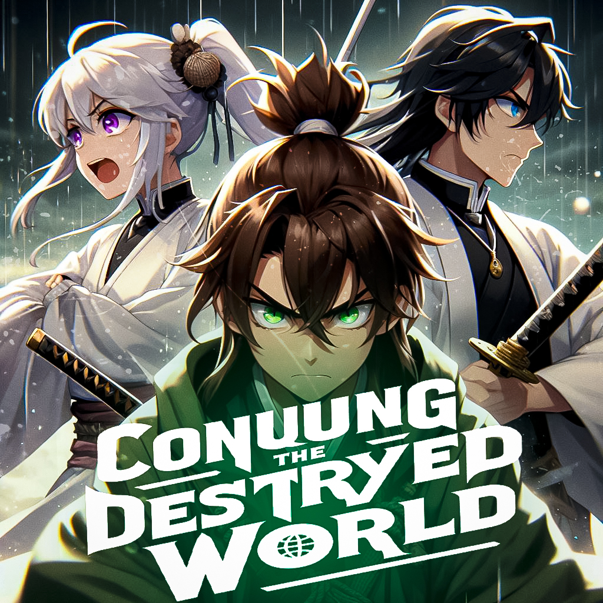

## **CONQUERING A BROKEN WORLD** 

  
  

## Дорогие посетители,
С великим удовольствием представляю вам мой проект — визуальную новеллу под названием **CONQUERING A BROKEN WORLD** (Покорение сломанного мира).
Этот проект был создан с любовью и страстью, и я надеюсь, что каждый из вас найдет в нем нечто особенное.
Погрузитесь в уникальную историю, где каждое ваше решение влияет на развитие сюжета.
Вас ждут захватывающие повороты, загадочные персонажи и увлекательные приключения. "Покорение сломанного мира" — это не просто новелла, это ваше личное путешествие в мир фантазии.
## Автор x1nell
*Описание: "ПОКОРЕНИЕ СЛОМАННОГО МИРА" В далеком и загадочном мире, где судьбу решает человек, произошло неожиданное событие.
Величественные королевства Белое Инь и Черный Янь столкнулись, множество противоположностей и споров повлияло на острое лезвие судьбы. 
Ведь теперь границы разделяли людей, отправлявшихся по полностью противоположным путям.
Со временем королевства укрепились и прошло много лет, но ни один человек из Инь так и не переступил порог Янь.
Чем могло быть вызвано такое решение? Может быть, это было из-за страха или предубеждений, присущих обоим королевствам?
Или, может быть, одержимость своим истинным путям, не позволяла проникнуть на территорию Янь? Кацуми предстоит всё узнать и изменить!*
## `https://x1nell.github.io/destroyWorldNovelle/`
https://x1nell.github.io/destroyWorldNovelle/
## Можно скачать репозиторий и запустить новеллу на своем компьютере,
*Желаю вам приятного прохождения, захватывающих впечатлений и открытия для себя новых граней искусства визуальных новелл!*
## **x1nell**
